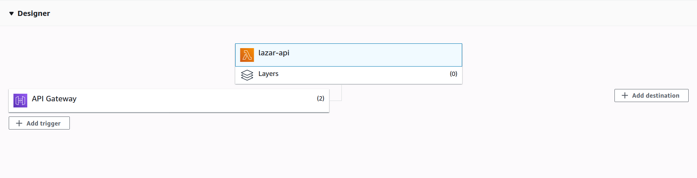
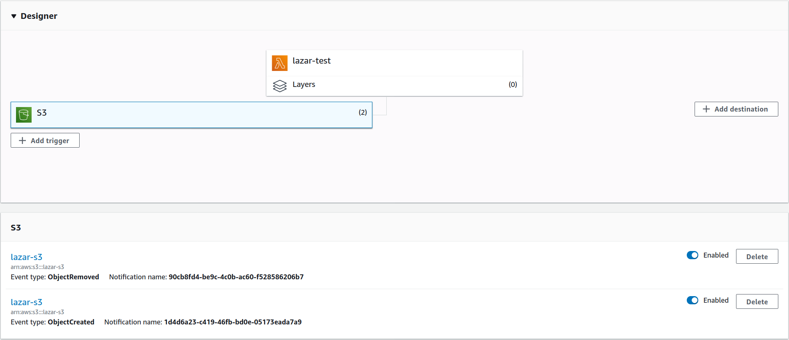
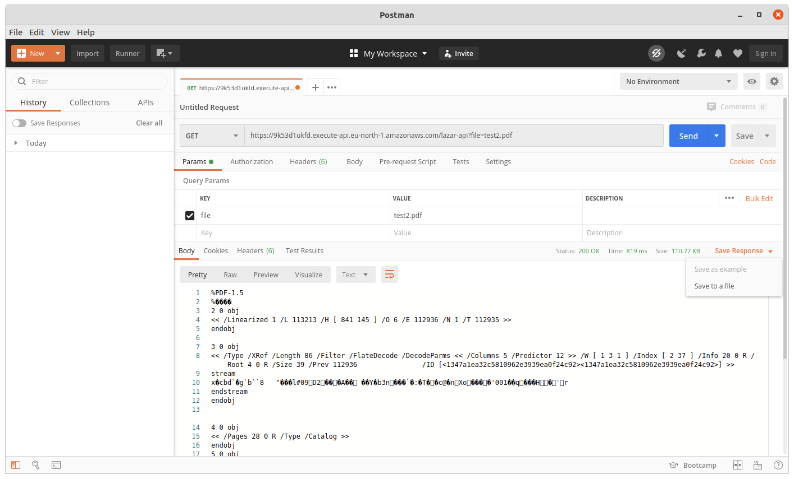
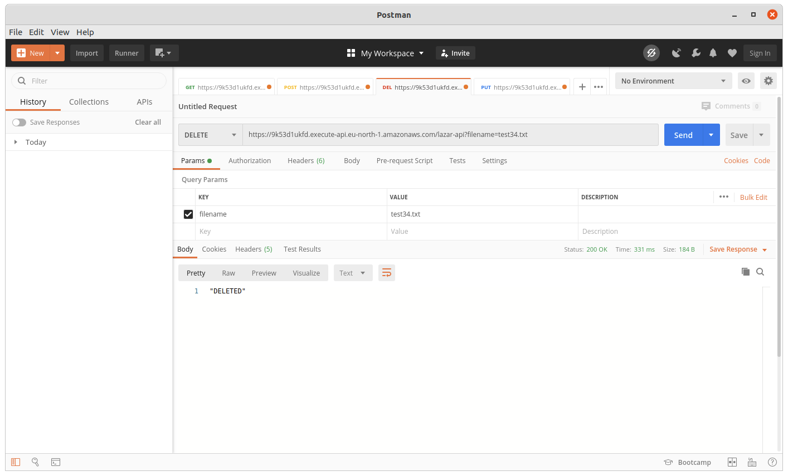
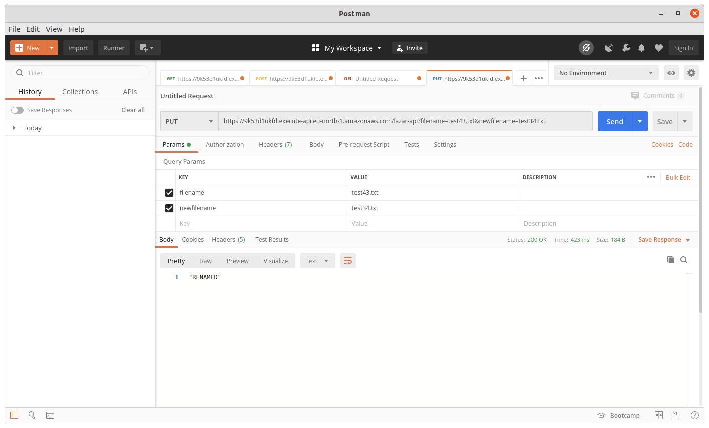
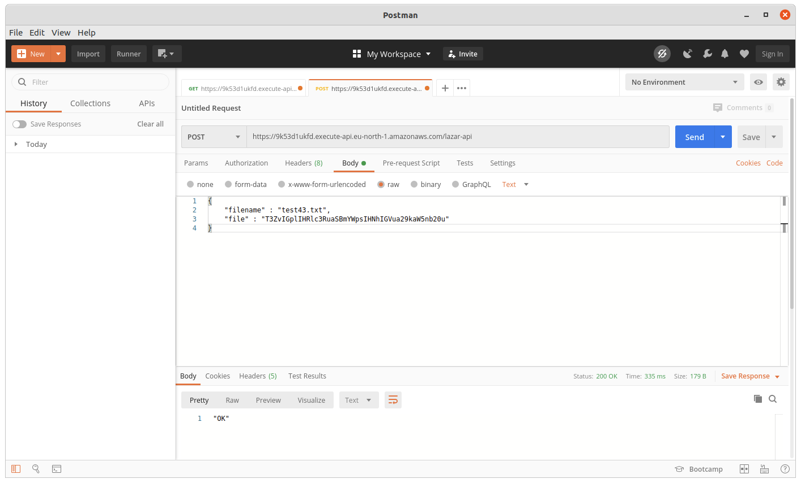

# Zadatak 6

Formirati bucket pod nazivom Master-broj-indeksa na AWS S3 servisu. Koristeći AWS Lambda, u programskom jeziku po izboru, kreirati REST API koji služi za manipulaciju fajlovima unutar formiranog bucket-a. API treba da sadrži sledeće metode:
* POST - upload fajla,
* GET - download fajla,
* DELETE - brisanje fajla,
* PUT - promena imena fajla.
  
Dodatno, formirati DynamoDB tabelu koja za svaki fajl u bucket-u, pored naziva fajla sadrži broj redova, broj reči i broj karaktera u datom fajlu. Voditi računa da tabela uvek bude konzistentna sa sadržajem bucket-a.

Takođe, tabela treba da ostane ažuirana ukoliko se sadržaj bucket-a promeni manuelnim pozivom S3 servisa, tj. bilo kojom akcijom na bucket-u Master-broj-indeksa. Koristiti event/trigger mehanizam.

## Infrastruktura

Na AWS-u su upotrebljeni sledeci servisi:
* S3
* DynamoDB
* API Gateway
* IAM
* Lambda

Napravljene su dve lambda funkcije, jedna koja je API i koja manipulise objektima u skladistu i funkcija koja reaguje na dogadjaj u skladistu.

Putem simple HTTP api-ja pozivamo lambda funkciju koja je zaduzena za manipulaciju objektima. U zavisnosti od vrste zahteva funkcija izvrsava odredjene radnje nad skladistem. Pristupna tacka lambda funkcije se dodaje kao trigger na API Gateway. U ovom primeru, pristupna tacka je na sledecoj lokaciji: https://9k53d1ukfd.execute-api.eu-north-1.amazonaws.com/lazar-api.

Druga lambda funkcija ima triggere na odredjene dogadjaje u S3 korpi. Kada se desi odredjeni dogadjaj okida se funkcija koja u DynamoDB tabelu upisuje potrebne informacije o objektu (ili ih brise).

Da bi ovo bilo moguce potrebno je putem IAM servisa dodeliti privilegije nad potrebnim resursima.

## Kako koristiti

Tesitanje cemo vrsiti putem Postman-a. Na raspolaganju su nam sledeci pozivi:

* **GET** - kao argument prima parametar *file* koji predstavlja naziv fajla koji zelimo da preuzmemo. Zahtev kao odgovor vraca base64 enkodovanu string reprezentaciju fajla. Postman nam omogucava da to sacuvamo kao fajl (Save Response -> Save to a file): 
* **DELETE** - kao argument prima parametar *filename* koji predstavlja naziv fajla koji zelimo da obrisemo 
* **PUT** - kao argumente prima *filename* i *newfilename* koji redom predstavljaju naziv fajla cije ime menjamo i zeljeno ime fajla 
* **POST** - kao argumente prima *filename* i *file*. *File* je string, base64, reprezentacija fajla koji zelimo da postavimo u korpu. Potrebno je da fajl prvo pretvorimo u base64, to mozemo da uradimo pomocu nekog programskog jezika ili [online alata](https://base64.guru/converter/encode/file), a zatim putem Postmana poslati POST zahtev koji ima *raw* body u JSON formatu, na sledeci nacin:  Zahtevom je okinuta lambda funckija koja je fajl postavila u skladiste, nakon cega je okinuta druga lambda funkcija koja je to upisala u DynamoDB tabelu.

DynamoDB tabela ostaje konzistentna posle svih promena u skladistu, bile one izvrsene putem API poziva ili manuelno, iz korisnickog interfejsa servisa.